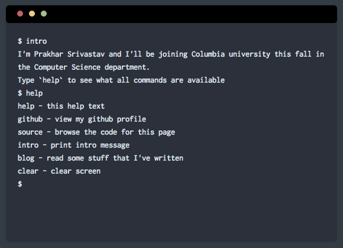

# React Term

A couple of days back, I got an email from Columbia (the university that I'm stated to join) informing me that my new email ID and other student IT services were ready. Hosting my own webpage on a university's domain had long been a wish of mine, so as soon as I learnt about having some server space on the university's server I got excited wanted to put something interesting. Since I already have a boring [about me](http://prakhar.me/about) page, I went with something different and built a simple terminal emulator in [React](http://facebook.github.io/react/)!



Demo - http://columbia.edu/~ps2894

### Run
```
$ npm install
$ npm run dist
```

### Dev
```
$ npm install
$ npm run watch
```
